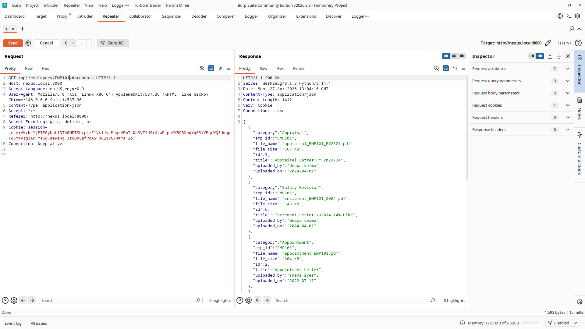
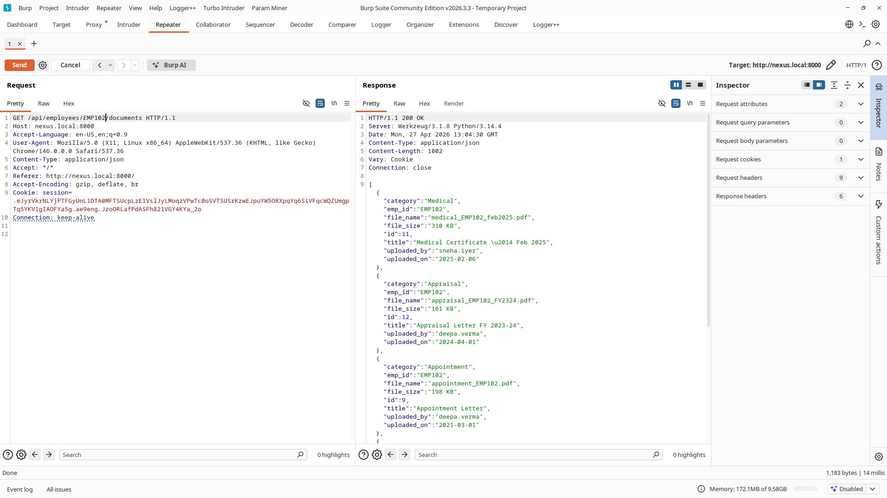

# Penetration Testing Report — Nexus HR Internal Portal

**Assessment Type:** Web Application Penetration Test  
**Target:** Nexus HR Internal Portal (`http://nexus.local:8000`)  
**Tester:** Anshukumar Pal  
**Date:** April 2026  
**Severity:** Medium (CVSS 6.5)

---

## Project Overview

This report documents a penetration test conducted on the Nexus HR Internal Portal, a Flask-based web application used to manage employee records, payslips, documents, and leave requests.

The application was found to be vulnerable to **Insecure Direct Object Reference (IDOR)** due to insufficient server-side authorisation checks on several API endpoints. The application trusts the employee ID supplied in the URL without verifying whether the requesting user is authorised to access the referenced resource.

> **Note:** Testing was performed locally. The hostname `nexus.local` was added to `/etc/hosts` pointing to `127.0.0.1` to allow proxy interception via Burp Suite. In other environments, the target may be accessible at `localhost` or a local IP address on port `8000`.

---

## Scope

The following API endpoint was selected as the primary test target:

```
GET http://nexus.local:8000/api/employees/<EMP_ID>/documents
```

This endpoint retrieves official documents belonging to the employee identified by `<EMP_ID>`. Other endpoints using the same pattern (`/payslips`, `/leaves`, `/profile`) are subject to the same vulnerability.

**Testing method:** Gray-box (source code available, tested as an authenticated user)  
**Approach:** Manual, non-destructive — read-only exploitation only, no data was modified or deleted.

---

## Vulnerability Description

Insecure Direct Object Reference (IDOR) is an access control vulnerability that occurs when an application exposes internal object identifiers (such as database primary keys) in URLs or request parameters, and fails to verify whether the requesting user is permitted to access the referenced object.

In this application, the employee ID (`EMP101`, `EMP102`, etc.) is used directly in the API path to identify which employee's data to return. The vulnerable endpoints check only that the user is logged in, but do not verify that the logged-in user is requesting their own data. This allows any authenticated employee to access any other employee's records simply by changing the ID in the URL.

**OWASP Classification:** API1:2023 — Broken Object Level Authorization (BOLA)

---

## Scope Assumptions

- we were authorised to access the application as a regular employee (no admin credentials used during the exploit demonstration)

---

## Test Evidence

### Step-by-Step Reproduction

**1. Authenticate as a low-privileged employee**

Logged in as `arjun.mehta` (Employee ID: `EMP101`) using valid credentials via the login endpoint.

**2. Capture a legitimate request**

Navigated to the documents section of the portal. The browser issued the following request:

```
GET /api/employees/EMP101/documents HTTP/1.1
Host: nexus.local:8000
Cookie: session=<arjun.mehta session token>
```

Response: `200 OK` — returned EMP101's own documents as expected.

**3. Tamper with the Employee ID**

The request was sent to Burp Suite Repeater. The Employee ID in the URL was changed from `EMP101` to `EMP102` (Sneha Iyer), with no other modifications.

```
GET /api/employees/EMP102/documents HTTP/1.1
Host: nexus.local:8000
Cookie: session=<arjun.mehta session token>
```

**4. Observe the response**

The server returned `200 OK` with EMP102's full document listing — including offer letters, appointment letters, ID proof documents, and appraisal letters — without any authorisation error.



*Figure 1: Arjun (EMP101) accessing his own documents — legitimate request*



*Figure 2: Same session, Employee ID changed to EMP102 — server returns Sneha's documents*

### Impact

A regular employee can use this vulnerability to access any other employee's:

- Official documents (offer letters, appraisal letters, ID proofs)
- Salary and payslip data
- Leave history
- Personal profile information (address, date of birth, emergency contacts)

This constitutes unauthorised access to sensitive personal and financial data across the entire employee directory.

---

## Risk Rating

| Metric                  | Value                              |
|-------------------------|------------------------------------|
| **CVSS Base Score**     | 6.5                                |
| **Severity**            | Medium                             |
| **CVSS Vector**         | AV:N/AC:L/PR:L/UI:N/S:U/C:H/I:N/A:N |
| **Attack Vector**       | Network                            |
| **Attack Complexity**   | Low                                |
| **Privileges Required** | Low (valid employee account)       |
| **User Interaction**    | None                               |
| **Confidentiality**     | High                               |
| **Integrity**           | None                               |
| **Availability**        | None                               |
| **OWASP Category**      | API1:2023 — BOLA / IDOR            |

**Justification:**
- **Network (AV:N):** The attack is performed remotely over HTTP — no local or physical access required.
- **Low Complexity (AC:L):** Exploitation requires only changing a numeric/string ID in the URL. No special tools, timing, or conditions needed.
- **Low Privileges (PR:L):** The attacker must hold a valid employee account. Unauthenticated access is not possible.
- **High Confidentiality (C:H):** Successful exploitation exposes sensitive personal, financial, and HR data of all employees.

---

## Remediation

### Root Cause

The vulnerable endpoints validate that the user is authenticated (session cookie is present) but do not validate that the authenticated user is authorised to access the specific `EMP_ID` referenced in the URL.

**Vulnerable code (documents endpoint — access check removed):**

```python
@app.route('/api/employees/<emp_id>/documents')
@login_required
def get_documents(emp_id: str):
    conn = get_db()
    try:
        # no authorisation check — any logged-in user reaches this point
        rows = conn.execute(
            'SELECT * FROM documents WHERE emp_id = ? ORDER BY uploaded_on DESC',
            (emp_id,)
        ).fetchall()
    finally:
        conn.close()
    return jsonify([dict(r) for r in rows]), 200
```

### Fix

Reinstate the `can_read_employee_data()` check before returning any data. This function compares the `emp_id` in the URL against the employee ID stored in the server-side session, ensuring users can only access records they are explicitly authorised to view (their own records, or subordinates' records if they are a manager).

```python
@app.route('/api/employees/<emp_id>/documents')
@login_required
def get_documents(emp_id: str):
    conn = get_db()
    try:
        if not can_read_employee_data(emp_id, conn):
            return jsonify({'error': 'Access denied.'}), 403
        rows = conn.execute(
            'SELECT * FROM documents WHERE emp_id = ? ORDER BY uploaded_on DESC',
            (emp_id,)
        ).fetchall()
    finally:
        conn.close()
    return jsonify([dict(r) for r in rows]), 200
```

This fix must be applied consistently to **all** employee-scoped endpoints:

| Endpoint | Fix Required |
|---|---|
| `GET /api/employees/<emp_id>/profile` | ✅ Apply check |
| `GET /api/employees/<emp_id>/payslips` | ✅ Apply check |
| `GET /api/employees/<emp_id>/documents` | ✅ Apply check |
| `GET /api/employees/<emp_id>/leaves` | ✅ Apply check |

### General Recommendation

Authorization must always be enforced server-side. The URL, request body, and all client-supplied parameters are fully under the user's control and cannot be trusted to reflect only what the UI exposes. Every request for a user-scoped resource must verify on the server that the requesting session is permitted to access that specific resource.
